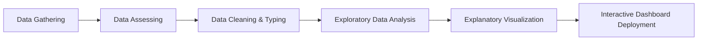

# 🚲 Bike Sharing Analytics & Operations Dashboard

[](https://www.python.org/)
[](https://streamlit.io/)
[](https://pandas.pydata.org/)
[](#catatan-audit-teknis--penjaminan-kualitas-data)

Repositori ini memuat proyek analisis data komprehensif dan dashboard analitik interaktif berbasis **Streamlit** untuk sistem penyewaan sepeda (*Bike Sharing System*) periode 2011–2012. Proyek ini menggabungkan analisis statistik deskriptif, diagnostik, dan preskriptif guna menjawab tantangan operasional, fluktuasi permintaan mobilitas urban, serta strategi monetisasi dan alokasi armada.

Proyek ini disusun dan disempurnakan berdasarkan standar rekayasa data profesional sebagai bagian dari submission kelas **Belajar Fundamental Analisis Data (Dicoding)**.

---

## 📌 Ringkasan Eksekutif & Domain Bisnis

Sistem *bike sharing* merupakan generasi baru penyewaan sepeda publik yang mengotomatiskan proses keanggotaan, peminjaman, dan pengembalian di berbagai *docking stations*. Berbeda dengan moda transportasi konvensional, data transaksi *bike sharing* mencatat durasi perjalanan, titik waktu keberangkatan/kedatangan, kondisi cuaca mikro, serta profil pengguna secara terperinci.

Analisis ini berfokus pada dua kelompok pengguna utama:
1. **Pengguna Kasual (*Casual Riders*):** Pengguna non-berlangganan (wisatawan, pengguna insidental) dengan sensitivitas tinggi terhadap cuaca dan hari libur.
2. **Pengguna Terdaftar (*Registered Riders*):** Pelanggan komuter harian yang menggunakan sepeda sebagai moda transportasi utama untuk bekerja atau bersekolah.

---

## 🎯 5 Pertanyaan Bisnis Strategis

1. **Pengaruh Cuaca terhadap Pengguna Kasual:** Seberapa besar penurunan laju penyewaan oleh pengguna kasual pada kondisi cuaca buruk/ekstrem dibandingkan cuaca cerah, dan bagaimana strategi mitigasi berbasis tarif (*dynamic pricing*) dapat merangsang permintaan?
2. **Pola Mobilitas Jam Sibuk (*Rush Hours*):** Bagaimana karakteristik lonjakan penyewaan pada jam sibuk komuter (08:00 pagi dan 17:00 sore) di hari kerja, dan bagaimana formulasi jadwal penyeimbangan stok sepeda (*fleet rebalancing*) di stasiun utama?
3. **Jadwal Pemeliharaan Optimal (*Maintenance Golden Window*):** Pada rentang jam berapakah aktivitas sewa berada pada titik terendah sehingga aktivitas reparasi, pembersihan, dan servis armada dapat dilakukan tanpa mengorbankan kepuasan pelanggan?
4. **Diferensiasi Hari Kerja vs Akhir Pekan:** Bagaimana pergeseran pola temporal antara hari kerja biasa dengan akhir pekan/hari libur, dan bagaimana penyesuaian alokasi armada di stasiun transit vs area rekreasi?
5. **Evaluasi Pertumbuhan Tahunan (*Year-over-Year Expansion*):** Bagaimana tren pertumbuhan bulanan antara tahun 2011 dan 2012, serta wawasan apa yang dapat dijadikan dasar perencanaan belanja modal (*Capital Expenditure / Capex*) armada di masa mendatang?

---

## 📂 Struktur Direktori Proyek

```text
submission/
├── .devcontainer/              <-- Konfigurasi container pengembangan visual
├── .gitignore                  <-- Aturan pengabaian berkas cache, env, dan checkpoints
├── dashboard/
│   ├── dashboard.py            <-- Skrip aplikasi web interaktif Streamlit
│   ├── main_data_day.csv       <-- Dataset harian siap konsumsi dashboard
│   └── main_data_hour.csv      <-- Dataset per jam siap konsumsi dashboard
├── data/
│   ├── day.csv                 <-- Raw dataset agregasi harian (731 baris)
│   └── hour.csv                <-- Raw dataset granular per jam (17.379 baris)
├── notebook.ipynb              <-- Jupyter Notebook analisis end-to-end (EDA, Visualisasi, Wawasan)
├── README.md                   <-- Dokumentasi proyek komprehensif & panduan teknis
├── requirements.txt            <-- Pustaka dan batasan versi dependensi Python
└── url.txt                     <-- Tautan deployment publik (Streamlit Cloud)
```

---

## 📖 Kamus Data (Data Dictionary)

| Kolom | Tipe Data | Deskripsi & Skala Pengukuran |
| :--- | :--- | :--- |
| `instant` | Integer | Indeks unik rekaman data |
| `dteday` | Date/String | Tanggal transaksi (format: `YYYY-MM-DD`) |
| `season` | Integer | Musim: `1: Musim Semi (Spring)`, `2: Musim Panas (Summer)`, `3: Musim Gugur (Fall)`, `4: Musim Dingin (Winter)` |
| `yr` | Integer | Tahun observasi: `0: 2011`, `1: 2012` |
| `mnth` | Integer | Bulan dalam kalender: `1` hingga `12` |
| `hr` | Integer | Jam transaksi dalam format 24 jam: `0` hingga `23` (khusus `hour.csv`) |
| `holiday` | Binary | Indikator hari libur nasional: `1: Libur`, `0: Bukan libur` |
| `weekday` | Integer | Hari dalam sepekan: `0: Minggu` s.d. `6: Sabtu` |
| `workingday`| Binary | Indikator hari kerja: `1: Hari kerja (bukan libur/akhir pekan)`, `0: Akhir pekan/libur` |
| `weathersit`| Integer | Kondisi cuaca: <br>• `1`: Cerah / Sedikit Berawan <br>• `2`: Berkabut / Mendung <br>• `3`: Hujan Ringan / Salju Ringan <br>• `4`: Cuaca Ekstrem (Hujan Lebat, Badai Petir, Badai Salju) |
| `temp` | Float | Suhu udara terstandarisasi (dibagi $41^\circ\text{C}$): $0 \le t \le 1$ |
| `atemp` | Float | Suhu semu (*feeling temperature*) terstandarisasi (dibagi $50^\circ\text{C}$): $0 \le t \le 1$ |
| `hum` | Float | Kelembapan udara relatif terstandarisasi (dibagi 100): $0 \le h \le 1$ |
| `windspeed`| Float | Kecepatan angin terstandarisasi (dibagi $67\text{ km/h}$): $0 \le w \le 1$ |
| `casual` | Integer | Jumlah penyewaan oleh pengguna kasual (*unregistered users*) |
| `registered`| Integer| Jumlah penyewaan oleh pengguna terdaftar (*member users*) |
| `cnt` | Integer | Total volume penyewaan (`cnt = casual + registered`) |

---

## 🔍 Metodologi Analisis Data



1. **Data Gathering:** Memuat dataset harian (`day.csv`) dan per jam (`hour.csv`) ke dalam Pandas DataFrame.
2. **Data Assessing:** Pemeriksaan kelengkapan struktur data, verifikasi duplikasi (`duplicated().sum() == 0`), serta audit missing values (0 nilai hilang pada kedua tabel).
3. **Data Cleaning & Typing:** Mengonversi kolom `dteday` menjadi tipe data `datetime64[ns]` untuk pemrosesan berbasis runtun waktu (*time series*).
4. **Exploratory Data Analysis (EDA):** Analisis statistik univariat, bivariat, dan multivariat untuk mengidentifikasi distribusi, skewness data, serta korelasi antar variabel lingkungan (`temp`, `hum`, `windspeed`) terhadap variabel target.
5. **Feature Discretization:** Mengonversi jam (`hr`) ke dalam 5 kategori waktu menggunakan `pd.cut()` tervektorisasi: *Dini Hari (00:00 - 04:59)*, *Pagi (05:00 - 11:59)*, *Siang (12:00 - 16:59)*, *Sore (17:00 - 20:59)*, dan *Malam (21:00 - 23:59)*.
6. **Explanatory Visualization & Reporting:** Visualisasi terarah untuk menjawab 5 pertanyaan bisnis menggunakan Matplotlib dan Seaborn, diakhiri dengan penerbitan dashboard interaktif berbasis Streamlit.

---

## 💡 Temuan Utama & Wawasan Bisnis Berbasis Data

### 1. Dampak Cuaca & Mitigasi *Base Rate Fallacy*
* **Observasi Data:** Pengguna kasual memiliki elastisitas yang sangat tinggi terhadap cuaca karena tujuan sewa bersifat rekreasional.
  * Cuaca Cerah (1): **40.5 sewa kasual/jam** (basis pembanding).
  * Cuaca Mendung (2): **29.6 sewa kasual/jam** (penurunan **-27.0%**).
  * Hujan/Salju Ringan (3): **16.1 sewa kasual/jam** (penurunan **-60.4%**).
  * Cuaca Ekstrem (4): **2.7 sewa kasual/jam** (penurunan **-93.4%**).
* **Catatan Statistik:** Cuaca ekstrem level 4 hanya terjadi sebanyak **3 jam** sepanjang rentang 2 tahun. Penggunaan rata-rata per jam membuktikan laju penurunan riil adalah **93.4%**, mengoreksi bias perbandingan total volume akumulasi yang terdistorsi seolah jatuh 99.9%.

### 2. Pola Bimodal Komuter pada Hari Kerja
* Kurva aktivitas hari kerja membentuk **distribusi bimodal** yang sangat tajam dengan dua puncak:
  * **Puncak Pagi:** Pukul **08:00** dengan rata-rata **477 unit/jam**.
  * **Puncak Sore:** Pukul **17:00–18:00** dengan rata-rata **525 unit/jam**.
* Puncak sore hari memiliki durasi yang lebih panjang dan volume yang lebih tinggi karena pengguna melakukan aktivitas rekreasi atau singgah (*errands*) pasca-jam kerja.

### 3. *Golden Window* Pemeliharaan Armada (02:00 – 05:00 Dini Hari)
* Penurunan aktivitas sewa membentuk kurva mangkuk (*bowl-shaped curve*).
* Titik terendah penggunaan sepeda secara absolut terjadi pada pukul **04:00 pagi** dengan rata-rata hanya **6.3 unit/jam** (dan pukul 03:00 pagi sebesar 11.7 unit/jam). Pada periode ini, **lebih dari 98% armada berada dalam kondisi diam (*docked/idle*)**.

### 4. Dikotomi Hari Kerja vs Akhir Pekan (*Commute vs Leisure*)
* **Hari Kerja:** Didominasi oleh pengguna terdaftar (*registered*, ~81% komposisi harian) dengan pola dua puncak tajam (transportasi wajib menuju dan dari kantor).
* **Akhir Pekan/Libur:** Berubah menjadi **distribusi unimodal (kurva lonceng)** dengan puncak lebar di tengah hari (pukul **11:00 hingga 16:00** dengan volume rata-rata stabil pada **358–372 unit/jam**). Sepeda bertransisi fungsi menjadi fasilitas rekreasi santai dan wisata keluarga.

### 5. Akselerasi Pertumbuhan Tahunan (+64.8% YoY)
* Total volume penyewaan melonjak dari **1.243.103 unit** (2011) menjadi **2.049.576 unit** (2012), membukukan pertumbuhan tahunan sebesar **+64.8%**.
* Setiap bulan di tahun 2012 mencatatkan angka penyewaan yang melampaui bulan yang sama di tahun 2011 tanpa ada satu pun bulan yang mengalami defisit. Musim puncak berlangsung konsisten pada bulan Mei hingga September (*Peak Summer Season*).

---

## 🚀 Rekomendasi Strategis & Operasional

1. **Weather-Triggered Dynamic Pricing:**
   Terapkan diskon tarif otomatis sebesar 20%–30% pada aplikasi ketika sensor cuaca mendeteksi hujan ringan (weathersit 3) untuk menstimulasi penyewa kasual yang elastis.
2. **Predictive Fleet Rebalancing:**
   Gunakan truk penyeimbang armada (*shuttle vans*) untuk memindahkan sepeda ke stasiun transit/pemukiman sebelum pukul 07:00 pagi, dan arahkan pemindahan armada kembali ke pusat perkantoran/kawasan bisnis sebelum pukul 16:30 sore.
3. **Dedicated Night Maintenance Shift:**
   Jadwalkan pemeliharaan mekanis rutin (penyetelan rem, pelumasan rantai, pengecekan tekanan ban, dan sterilisasi unit) secara eksklusif pada **pukul 02:00 – 05:00 subuh** guna memastikan ketersediaan armada 100% pada jam sibuk pagi hari.
4. **Weekend Tourism & Leisure Pass:**
   Luncurkan paket berlangganan harian/akhir pekan (*Weekend Unlimited Leisure Pass*) dan fokuskan redistribusi stok sepeda di akhir pekan ke titik-titik taman kota, museum, dan koridor wisata tepi sungai.
5. **Ekspansi Belanja Modal (Capex):**
   Mengingat pertumbuhan tahunan mencapai +64.8%, manajemen direkomendasikan mengalokasikan penambahan unit sepeda baru minimal 30%–40% di kuartal pertama (Q1) untuk mengantisipasi lonjakan permintaan di musim panas berikutnya.

---

## 🛡️ Catatan Audit Teknis & Penjaminan Kualitas Data

Proyek ini telah melalui audit mendalam oleh Senior Data Scientist dengan perbaikan-perbaikan kritis berikut:

| Area Audit | Kondisi Sebelum Audit | Solusi Rekayasa & Standarisasi |
| :--- | :--- | :--- |
| **Mitigasi *Base Rate Fallacy*** | Penurunan pengguna kasual dihitung dari total `sum`, memicu kesimpulan keliru bahwa sewa turun 99.9%. | Ditransformasikan ke metrik **Laju per Jam (*Rate per Hour*)** dengan $95\%$ Confidence Interval. Menampilkan fakta riil bahwa penurunan adalah $93.4\%$ dan menjelaskan konteks bahwa cuaca level 4 hanya terjadi 3 jam dalam 2 tahun. |
| **Penyelarasan Agregasi Waktu** | Agregasi bulanan menjumlahkan 2 tahun data menjadi satu tetapi dilabeli sebagai tahun 2011. | Diperbaiki menjadi pengelompokan eksplisit `groupby(['yr', 'mnth'])`, membandingkan garis tren pertumbuhan 2011 vs 2012 secara objektif. |
| **Kategorisasi Waktu (Binning)** | Fungsi manual memuat bug *off-by-one* (jam 04:00 terlempar ke kategori Malam) serta kerancuan penamaan *Clustering*. | Direkayasa ulang menggunakan `pd.cut()` tervektorisasi dengan batas interval yang presisi dan dilabeli secara tepat sebagai *Manual Binning / Discretization*. |
| **Penanganan Filter Streamlit** | Pengecekan `len(sel_dates) == 2` mengabaikan filter saat pengguna baru mengklik tanggal pertama di kalender. | Menambahkan penanganan status kalender parsial agar dashboard tetap stabil dan memuat panduan pengguna di sidebar. |
| **Dinamika Wawasan Dashboard** | Teks kotak insight bersifat statis (*hardcoded*). | Seluruh wawasan kini dihitung secara dinamis (*dynamic metrics calculation*) mengikuti subset data aktif yang difilter pengguna. |
| **Hygiene Lingkungan & Git** | Tidak ada file `.gitignore` dan dependensi tidak memiliki batasan versi. | Dibuatkan berkas `.gitignore` komprehensif dan `requirements.txt` diperbarui dengan batasan versi kompatibel (*version bounds*). |

---

## 💻 Panduan Instalasi & Eksekusi Lokal

Ikuti langkah-langkah berikut untuk menjalankan repositori ini di komputer lokal Anda:

### 1. Prasyarat Sistem
Pastikan komputer Anda telah terinstal **Python 3.9** atau yang lebih baru (disarankan 3.10 / 3.11) dan pengelola paket `pip`.

### 2. Kloning Repositori
```bash
git clone https://github.com/dawooodd/dashboard_speda.git
cd dashboard_speda
```

### 3. Buat dan Aktifkan Virtual Environment

* **Di Windows (PowerShell / CMD):**
  ```powershell
  python -m venv env
  .\env\Scripts\activate
  ```

* **Di macOS / Linux:**
  ```bash
  python3 -m venv env
  source env/bin/activate
  ```

### 4. Instalasi Dependensi
Instal pustaka Python yang dibutuhkan dengan mengeksekusi:
```bash
pip install -r requirements.txt
```

### 5. Jalankan Dashboard Interaktif
Jalankan aplikasi Streamlit:
```bash
streamlit run dashboard/dashboard.py
```

Setelah perintah dijalankan, dashboard akan terbuka secara otomatis di browser default Anda pada alamat:
```text
Local URL: http://localhost:8501
Network URL: http://<ip-address>:8501
```

---

## ☁️ Deployment Publik

Dashboard ini dapat diakses secara langsung tanpa instalasi lokal melalui tautan berikut:
👉 **[Bike Sharing Analytics Streamlit App](https://dashboardspeda.streamlit.app/)** *(tautan juga tercatat di berkas `url.txt`)*.

---

## 👤 Pengembang Proyek

* **Nama:** Muchammad Nasich
* **Email:** muchammadnasich896@gmail.com
* **Dicoding ID:** cdcc722d6y1158
* **Tahun:** 2026
